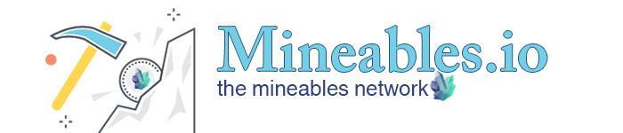
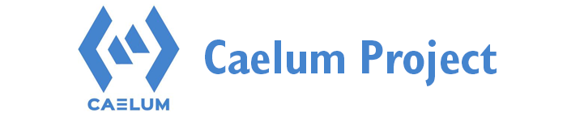

  
  

    
<a href="/0xbtc" a:link="#ffffff">0xBitcoin (0xBTC)</a>

  

 

  
  

      
<a href="https://cryptopepes.io/#0x8feA1cf4845417f0525f5EfFca0f312a8C419A4E" a:link="#ffffff" target="_blank">CrypoPepes.io</a>

  

 

  
  

      
<a href="https://mineables.io/" a:link="#ffffff" target="_blank">Mineables.io</a>

  

 

  
  

    
<a href="http://caelumproject.io/" a:link="#ffffff" target="_blank">Caelum Project</a>

  

&nbsp;

   <b><a href="#top">↥ back to top</a></b>

